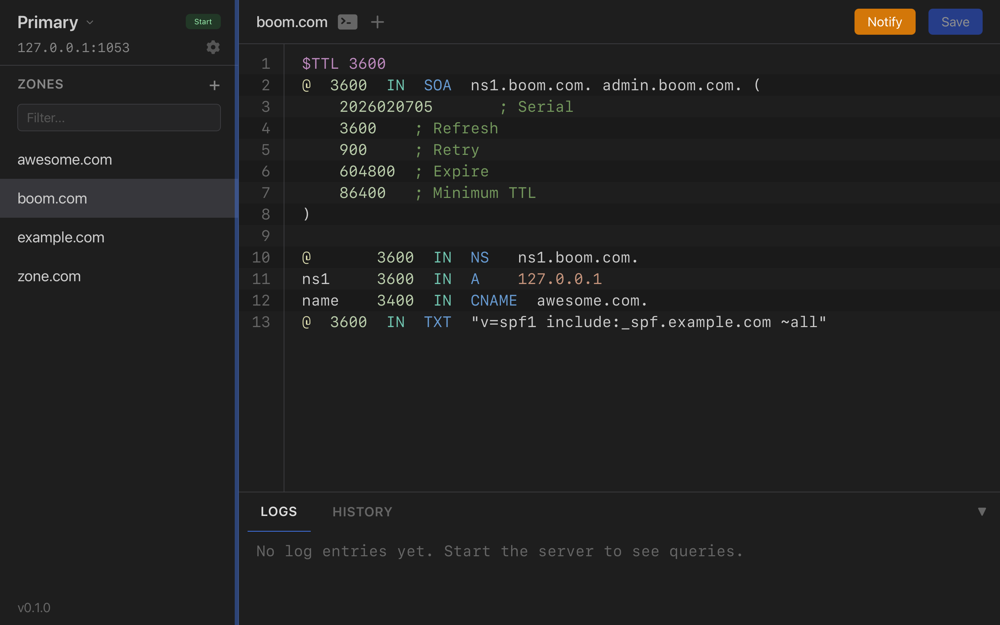

# Zonekeeper

A macOS desktop app for managing DNS zones locally. Edit zone files in a UI, serve them via CoreDNS, and let secondary servers pull via AXFR.

Built for developers who need a local authoritative DNS server with zone transfer support.



## What It Does

- **Edit zone files** with inline validation (catches invalid record types, missing TTLs)
- **Serve DNS** on port 1053 via bundled CoreDNS
- **AXFR support** — secondary servers can pull zone transfers
- **Live logs** — see every query, error, and server event in real time

## Architecture

```
┌─────────────────────────────────────┐
│  Tauri App                          │
│  ┌───────────────┐ ┌─────────────┐  │
│  │ Vue 3 Frontend│ │ Rust Backend │  │
│  │               │ │             │  │
│  │ Zone editor   │ │ Spawn       │  │
│  │ Zone list     │ │   CoreDNS   │  │
│  │ Log viewer    │ │ Generate    │  │
│  │ Status        │ │   Corefile  │  │
│  │               │ │ R/W zone    │  │
│  │               │ │   files     │  │
│  └───────┬───────┘ └──────┬──────┘  │
│          │  Tauri IPC      │         │
│          └─────────────────┘         │
│                    │                 │
│              spawns/manages          │
│                    ▼                 │
│          ┌─────────────────┐         │
│          │    CoreDNS       │         │
│          │  file + transfer │         │
│          │  + log plugins   │         │
│          └─────────────────┘         │
└─────────────────────────────────────┘
```

The Rust backend manages CoreDNS as a child process. It generates a `Corefile` from your configured zones and writes standard RFC 1035 zone files to disk. CoreDNS serves them with the `file` plugin and enables zone transfers with the `transfer` plugin.

## Frontend Architecture

The frontend follows **CQRS + Event Sourcing**:

```
src/
├── state/
│   ├── event-store.ts    # Reactive event store (Vue reactivity)
│   └── runners.ts        # Event handlers (CREATE, UPDATE, DELETE)
├── commands/
│   └── index.ts          # Write operations → Tauri backend + track events
├── queries/
│   └── index.ts          # Read operations → query from state
├── components/
│   ├── ServerStatus.vue  # CoreDNS start/stop + status indicator
│   ├── ZoneList.vue      # Zone sidebar with add/remove
│   ├── ZoneEditor.vue    # Zone file editor with inline validation
│   └── LogViewer.vue     # Collapsible real-time log panel
└── App.vue               # Root component, passes `app` down
```

**Commands** handle all writes (add zone, save zone, start server). They call the Tauri backend via `invoke()` and track events in the local event store.

**Queries** handle all reads (list zones, find zone, get logs). They read from the reactive event store state, which Vue's reactivity system tracks automatically.

**No emits.** All components receive the `app` object as a prop and call `app.commands.*` for writes, `app.queries.*` for reads, and `app.*` for UI actions.

## Data Storage

Zone files live in `~/Library/Application Support/zonekeeper/zones/` as standard zone files:

```
$TTL 3600
@  IN  SOA  ns1.example.com. admin.example.com. (
    1       ; Serial
    3600    ; Refresh
    900     ; Retry
    604800  ; Expire
    86400   ; Minimum TTL
)

@       3600  IN  NS   ns1.example.com.
ns1     3600  IN  A    127.0.0.1
www     3600  IN  A    192.168.1.10
```

The `Corefile` (CoreDNS config) is generated automatically at `~/Library/Application Support/zonekeeper/Corefile` whenever zones change:

```
example.com:1053 {
    file /path/to/zones/example.com.zone
    transfer {
        to *
    }
    log
}
```

## Zone Editor Validation

The editor validates zone files inline as you type:

- **Invalid record type** — flags typos like `CAME` instead of `CNAME`
- **Missing TTL** — flags records that have a class (IN) but no TTL value
- Skips comments, directives (`$TTL`, `$ORIGIN`), and SOA continuation lines

Errors appear as red badges on the affected line, matching the line number gutter.

## Prerequisites

- **macOS** 10.15+
- **Node.js** 18+
- **Rust** 1.83+
- **CoreDNS** binary (see [CoreDNS releases](https://github.com/coredns/coredns/releases))

## Development

```bash
# Install frontend dependencies
npm install

# Run in development mode (starts Vite dev server + Tauri)
npm run tauri dev

# Type-check
npx vue-tsc --noEmit

# Build for production
npm run tauri build
```

## Verification

Once running:

```bash
# Query a zone
dig @127.0.0.1 -p 1053 example.com A

# Test AXFR (zone transfer)
dig @127.0.0.1 -p 1053 axfr example.com

# Check SOA
dig @127.0.0.1 -p 1053 example.com SOA
```

## Stack

| Layer | Technology |
|-------|-----------|
| Desktop shell | Tauri v2 |
| Backend | Rust |
| Frontend | Vue 3 (Options API) |
| Styling | Tailwind CSS v4 |
| Bundler | Vite |
| DNS server | CoreDNS (bundled binary) |
| State management | CQRS + Event Sourcing |

## Tauri Commands

| Command | Description |
|---------|-------------|
| `start_server()` | Start CoreDNS process |
| `stop_server()` | Stop CoreDNS process |
| `server_status()` | Check if CoreDNS is running |
| `list_zones()` | List all configured zones |
| `create_zone(name)` | Create a zone with SOA template |
| `delete_zone(name)` | Remove a zone file |
| `read_zone(name)` | Read zone file content |
| `save_zone(name, content)` | Write zone file, triggers reload |

## Events

| Event | Direction | Payload |
|-------|-----------|---------|
| `log-line` | Rust → Frontend | `{ message, level }` |

## Releasing

```bash
# 1. Bump version in all three files
#    - package.json
#    - src-tauri/Cargo.toml
#    - src-tauri/tauri.conf.json

# 2. Build signed DMG
APPLE_SIGNING_IDENTITY="Developer ID Application: Your Name (TEAM_ID)" npm run tauri build

# 3. Verify signature
codesign -dv --verbose=2 src-tauri/target/release/bundle/dmg/ZoneKeeper_*.dmg

# 4. Commit, tag, push
git add -A && git commit -m "v0.2.0"
git tag v0.2.0
git push && git push --tags

# 5. Create GitHub release with DMG
gh release create v0.2.0 \
  src-tauri/target/release/bundle/dmg/ZoneKeeper_*.dmg \
  --title "v0.2.0" \
  --notes "Release notes here"
```

The DMG is signed with a Developer ID certificate. Tauri signs the .app bundle, embedded binaries (CoreDNS), and the DMG automatically when `APPLE_SIGNING_IDENTITY` is set.

## Project Structure

```
zonekeeper/
├── src/                          # Vue 3 frontend
│   ├── state/                    # Event store + runners
│   ├── commands/                 # CQRS write operations
│   ├── queries/                  # CQRS read operations
│   ├── components/               # Vue components
│   ├── App.vue                   # Root component
│   ├── main.ts                   # Entry point
│   └── style.css                 # Tailwind imports + base styles
├── src-tauri/
│   ├── src/
│   │   ├── commands/
│   │   │   ├── server.rs         # Start/stop CoreDNS
│   │   │   └── zones.rs          # Zone file CRUD
│   │   ├── coredns/
│   │   │   ├── process.rs        # CoreDNS process management
│   │   │   └── corefile.rs       # Corefile generation
│   │   ├── lib.rs                # Tauri setup + command registration
│   │   └── main.rs               # Entry point
│   ├── Cargo.toml
│   └── tauri.conf.json
├── package.json
├── vite.config.ts
├── postcss.config.js
├── tsconfig.json
└── tsconfig.node.json
```

